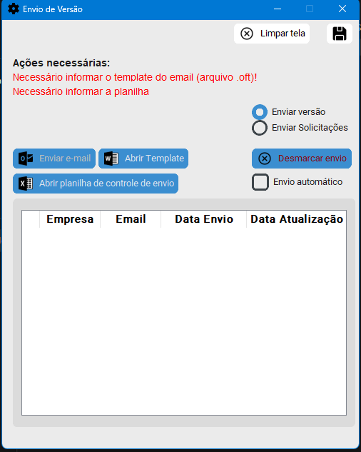
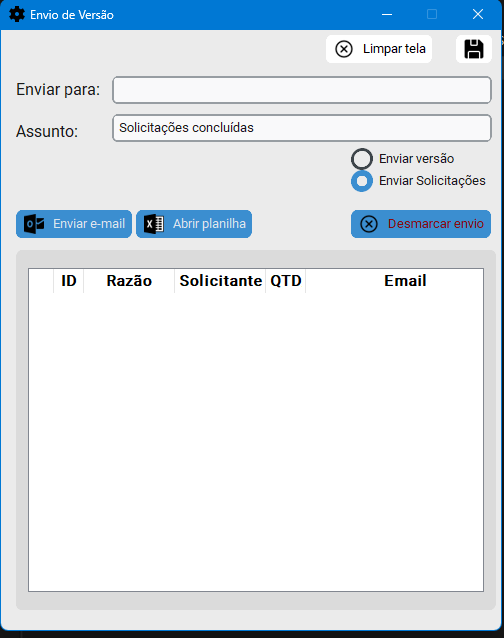
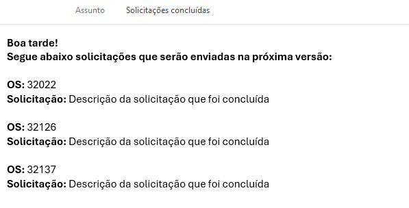

# 📌 Solução RPA para automação de leitura de planilhas e envio de e-mails

Projeto desenvolvido como parte dos meus estudos em Python.
O objetivo principal é automatizar o envio de e-mails com base em uma planilha de solicitações feitas por clientes,
e também permitir o disparo de e-mails em massa com base em uma planilha de contatos.

---

## ✅ Requisitos necessários

⚠️ Este processo está restrito ao envio de e-mails via **Outlook**, portanto, algumas ações prévias são necessárias:

* Ter o **Outlook instalado** na máquina, com uma conta válida.
* A **conta padrão do Outlook** será utilizada para envio dos e-mails. É necessário verificar qual conta está configurada como padrão.
* Todas as planilhas devem estar no formato correto (consulte os arquivos na pasta `arquivos_de_teste` como referência).

---

## ⚙️ Como o RPA funciona atualmente

### 🔹 Opção: Envio de Versão

Permite o envio de e-mails personalizados com base em um template `.oft` (arquivo do Outlook):

* O arquivo `.oft` deve conter o corpo e as configurações do e-mail.
* O usuário deve informar uma planilha com os seguintes dados:

  * Nome da empresa
  * E-mail
  * Data de envio

    * Caso a data de envio já esteja preenchida, o próprio programa irá marcar como "enviado" (mas ainda será possível realizar novos envios ou desmarcar).
  * Data de atualização
* É possível salvar a planilha de controle em uma pasta definida pelo usuário.
* Será possível selecionar os contatos desejados em uma grade visual e escolher entre duas formas de envio:

#### Envio Automático ✅

* E-mails são enviados diretamente, sem abrir o Outlook.
* Caso não sejam enviados, ficam na **caixa de saída do Outlook**.
* Há um intervalo de **3 segundos** entre os envios.

#### Envio Manual 📨

* Abre o Outlook com o e-mail pronto para cada contato selecionado.
* Permite revisar, alterar ou confirmar o e-mail antes do envio.
* Recomendado para garantir segurança e personalização.

---

### 🔹 Opção: Envio de Solicitações

Permite enviar e-mails com base em um relatório de solicitações feitas por clientes.
**Obs.:** O relatório original vem de outro sistema e contém dados sensíveis, por isso não está incluído na pasta de testes.

#### Processo realizado:

1. **Leitura do relatório (formato HTML).**
2. **Conversão automática para CSV** para facilitar o processamento.
3. **Agrupamento por solicitante**, com contagem das solicitações.
4. **Limpeza da coluna de solicitação**, removendo caracteres especiais.
5. Quando existir a tag `<resumo>` ou `--resumo`, apenas o conteúdo dessa seção será enviado.

   * Exemplo da estrutura de e-mail:
   
   

    para tornar a mensagem mais amigavel, o programa verifica o período do dia em que o email está sendo enviado
7. Se não houver resumo, o conteúdo completo da solicitação será limpo e utilizado no corpo do e-mail de forma mais amigável.

---

## 🚀 Funcionalidades atuais

* Leitura e tratamento de dados de uma planilha.
* Geração de e-mails personalizados, conforme cada solicitação.
* Envio em massa com opção de envio automático ou manual.
* Suporte a múltiplos templates `.oft`.
* Atualização automática da planilha de controle de envios.

---

## 🔧 Tecnologias utilizadas

* Python 3.13.2
* Pandas
* BeautifulSoup

---

## 📈 Status do projeto

✅ Projeto funcional e em uso no meu dia a dia.

⚠️ Em desenvolvimento — planejo aplicar melhorias como:

* Refatoração geral do código.
* Otimizações conforme novas necessidades surgirem.
